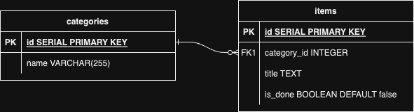

# Midterm: Project Planning Template

### Pick a Project
- Project: Smart To-Do List

### User Stories || User Scenarios
* As a user, I can add an item to the to-do list, because I want to remember the fun things I want to do
* As a user, I can check off an item from the to-do list, because I want to keep organized 
* As a user, I can change the category, in case it gets miscategorized
* As a user, I can edit the wording, in case I misspell something

### ERD

### Routes
* Browse, GET - /to-do
* Edit, POST - /to-do/:id
* Add, POST - /to-do
* Browse, GET - /category
* Read, GET - /category/:id

### Wireframes

### Resources:
- https://www.drawio.com/
- https://www.figma.com/templates/wireframe-kits/
